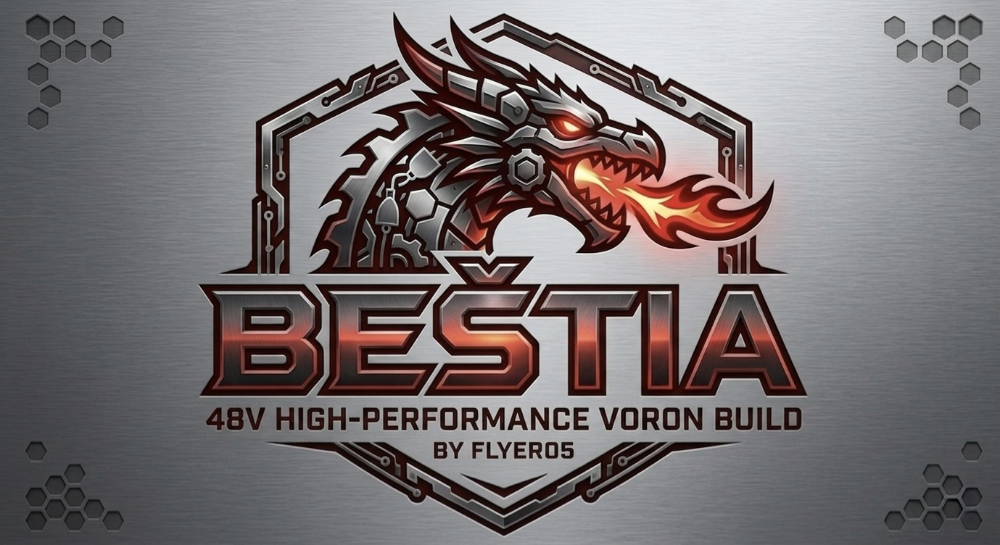

  

# Voron 2.4 "Beštia" - 48V High-Performance Build 🐉

[English version](#english) | [Slovenská verzia](#slovenská-verzia)

---

## English
# Voron 2.4 "Beštia" - 48V High-Performance Edition 🐉

This repository documents my highly modified **Voron 2.4 R2** build, nicknamed **"Beštia"** (The Beast). This machine is engineered for extreme speeds, maximum rigidity, and smart environmental monitoring.

## 🚀 Key Specifications

### Power & Control
* **Controller:** BTT Manta M8P V2 (32-bit)
* **Compute Module:** BTT CB2
* **Voltage:** 48V System for high-speed performance
* **Stepper Drivers:** BTT TMC5160T Pro (High-voltage)
* **Motors:** LDO Motor Kit V7 (High-temp/High-torque)
* **Communication:** BTT SB2240 CAN Bus via Stealthburner

### Motion & Mechanics
* **Gantry:** Funsorr Metal CNC X-Beam (Ultra Light version)
* **Reinforcements:** Titanium Frame Backers for improved resonance management
* **X-Axis:** All-metal CNC idlers and mounts
* **Linear Rails:** Turui Rust-proof 350mm (High durability)
* **Z-Probe:** CNC ChaoticLab Tap Sensor V2

### Smart Features & Sensors
* **UI:** BTT KNOMI 2 (Stealthburner integrated) & BTT 7" HDMI Touchscreen
* **Environmental:** SGP Sensors for VOC/Air quality monitoring
* **Filament:** BTT Smart Filament Sensor
* **Cooling:** 4x high-airflow fans for electronics bay cooling

## 🎨 Aesthetics & Lighting
* **Colorway:** Classic Black & Red (Voron Theme)
* **Enclosure:** BTT CNC ChaoticLab Door Kit
* **Lighting:** 2x 270mm WS2812B-RGB Light Bars (Addressable)

## 🔧 Project Goals
* Utilize **48V** architecture for extreme accelerations.
* Minimize gantry weight using the **Funsorr CNC beam** while maintaining rigidity with **Titanium backers**.
* Implement full VOC monitoring and smart safety macros via the **SGP sensors**.

---
*Built for speed. Engineered for precision. Known as Beštia.*

--

## Slovenská verzia
# Voron 2.4 350mm "Beštia" 48V Edition 🐉

Tento repozitár obsahuje konfiguráciu a dokumentáciu pre vysoko modifikovanú 3D tlačiareň **Voron 2.4 R2**. Cieľom tohto buildu je dosiahnutie maximálnej rýchlosti, tuhosti a inteligentného monitorovania tlače pomocou špičkových komponentov a 48V architektúry.

## 🚀 Technická špecifikácia

### Riadenie a Elektronika
* **MCU:** BTT Manta M8P V2 (32-bit control board)
* **Host:** BTT CB2 (Compute Board)
* **Napájanie:** 48V systém pre drivery motorov
* **Drivery:** BigTreeTech TMC5160T Pro (vysokonapäťové drivery pre X/Y)
* **Motory:** LDO Motor Kit V7 (High-temp, high-torque)
* **Displej:** BTT LCD 7" HDMI Touch v1.1
* **Toolhead interface:** BTT SB2240 CAN Bus (integrovaný TMC2240)

### Mechanika a Konštrukcia
* **Gantry:** Funsorr Metal CNC X-Beam Ultra Light
* **Výstuhy:** Titánové výstuhy rámu pre maximálnu tuhosť
* **X-os:** All-metal CNC idlers & držiaky
* **Lineárne vedenie:** Turui Linear Guides (Rust proof 350mm verzia)
* **Dvere:** BTT CNC ChaoticLab Door Kit
* **Senzor podložky:** CNC ChaoticLab Tap Sensor V2

### Toolhead a Senzory
* **Printhead:** Stealthburner s BTT KNOMI 2 (interaktívne UI)
* **Senzory prostredia:** SGP senzory pre monitorovanie kvality vzduchu (VOC)
* **Senzor filamentu:** BTT Smart Filament Sensor
* **Chladenie elektroniky:** 4x silné priemyselné ventilátory pre spodný deck

## 🎨 Vizuálny štýl a Osvetlenie
* **Farebná schéma:** Červeno-čierna klasika (Red/Black Voron theme)
* **Osvetlenie:** 2x 270mm WS2812B-RGB Light Bar (adresovateľné LED pásiky)
* **Status monitor:** KNOMI 2 animácie integrované v Stealthburneri

## 🔧 Klipper Konfigurácia (Hlavné črty)
* Využitie **48V** pre extrémne zrýchlenia bez straty krútiaceho momentu.
* **Input Shaper** optimalizovaný pre ultra-ľahkú CNC gantry a titánové výstuhy.
* Makrá pre **SGP senzory** – automatická regulácia filtrácie pri detekcii výparov.
* Dynamické RGB podsvietenie pre vizuálnu diagnostiku stavu tlačiarne.

---
*„Beštia nie je len tlačiareň, je to demonštrácia sily a precíznosti.“*
